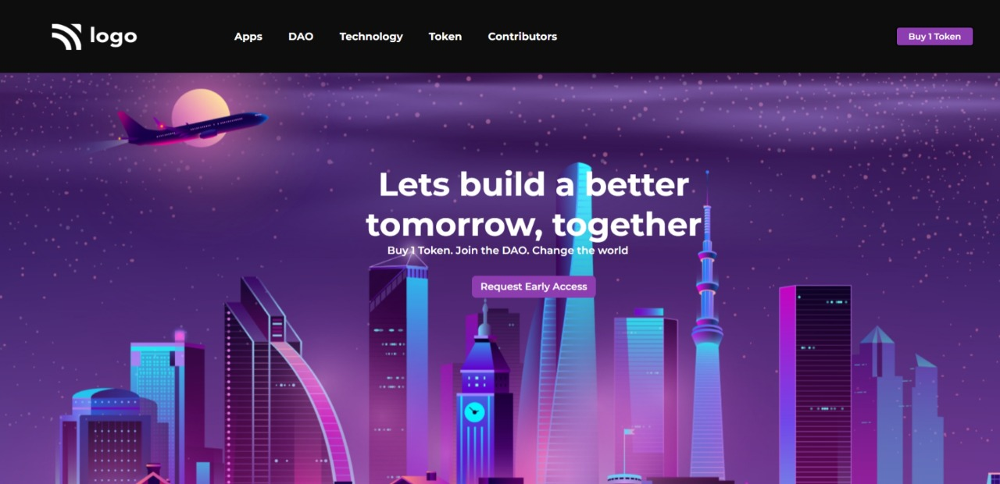

# Project-05-  A Small Web page
 ## Hey there ,  I am Amarjeet Kumar
 I have built a template of HTML and CSS project using my core css skills 
 
 
 
 

 My Live Deployed Website Link :- [Click here !](https://project-05-dao-technology.netlify.app/)

 
 

 ## For making this project I spend allmost 4 hour .

 ## What I learned from this project 
 - First of all I explore more about image adjustment on web page.
 - Then I learned a little bit about hover effects.